# Yummy Recipes

Yummy Recipes is a Flutter recipe application that brings people together through the joy of cooking. With the signature "Cook Together, Stay Together," our app provides a wide variety of recipes across multiple categories, featuring a clean interface and seamless user experience. Whether you're cooking for family, friends, or yourself, Yummy Recipes makes it easy to discover and share delicious meals.

## Features
- Multiple Recipe Categories: Access recipes by meal types (Breakfast, Lunch, Dinner, etc.)
- Dark/Light Theme: Toggle between dark and light modes with theme persistence
- Real-Time Search: Search functionality to find specific recipes with loading animations
- Dynamic UI: Responsive design that adapts to different screen sizes
- Image Caching: Efficient loading and caching of recipe images using CachedNetworkImage
- Cooking Mode: Interactive mode for following recipe steps with voice guidance using Flutter TTS
- Timer Functionality: Set timers for cooking steps with an alarm that plays when the timer ends
- Step Navigation: Navigate between recipe steps with next and previous options
- Recipe Card Display: View recipe cards with images, names, ratings, and cook times
- Hero Animation: Smooth transitions between screens using Hero animations
- Loading States: Skeleton loading screens for better UX
- Custom Fonts: Cairo font family integration
- Page Transitions: Smooth page transitions between screens

## Technologies Used
- Framework: Flutter
- State Management: BLoC Pattern (flutter_bloc)
- API Integration: Dio for HTTP requests
- Image Handling: Cached Network Image
- Theme Management: Custom theme implementation with SharedPreferences
- Animations: Lottie for custom animations
- Text-to-Speech: Flutter TTS for voice guidance
- Loading States: Skeletonizer for loading screens
- Page Transitions: Custom page transitions
- Device Preview: Device preview for responsive testing
- Code Quality: Flutter Lints

## API Integration
The app uses the Dummy JSON API to fetch recipe data across different categories. The base URL for the API is [https://dummyjson.com/test](https://dummyjson.com/test).

### Additional API Endpoints
- Categories: /recipes/meal-type/$mealType
- Recommended: /recipes?sortBy=rating&order=desc&limit=25
- Search: /recipes/search?q=$query

## Future Features
- Synced Cooking Experience: Allow two persons to cook together at the same time, synced in real-time.
- Recipe Sharing: Enable users to share their favorite recipes with friends and family.
- Nutritional Information: Display detailed nutritional facts for each recipe.

## Team
- Omar Gamal Saleh
- Yousef Mahmoud Dewidar
- Menna Ebrahim Abd Elhalim
- Shahd Muhammed Ali
- Doha Mohamed Ali
- Tarek Mohamed Ahmed

## Screenshots

### Splash Screen

## Light Mode

### Home Screen
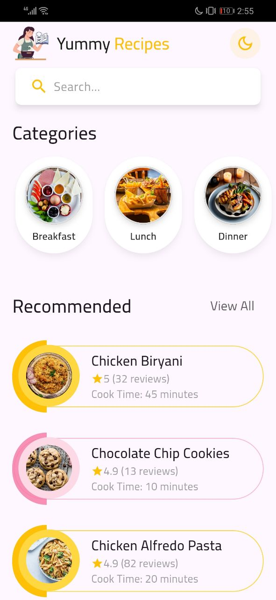

### Breakfast Recipes (Category Example)
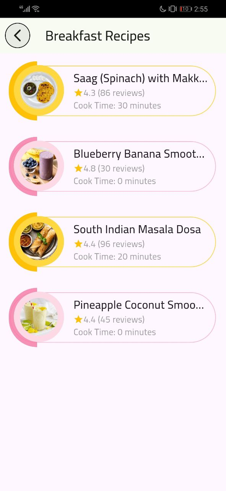

### Recommended Screen
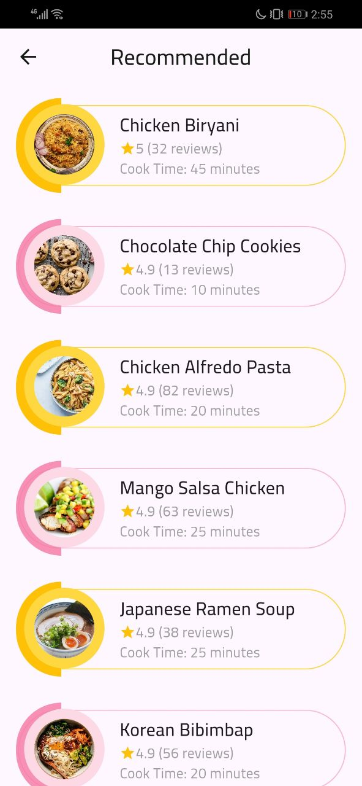

### Search Screen

### Search Results Screen

### Recipe Details Screen
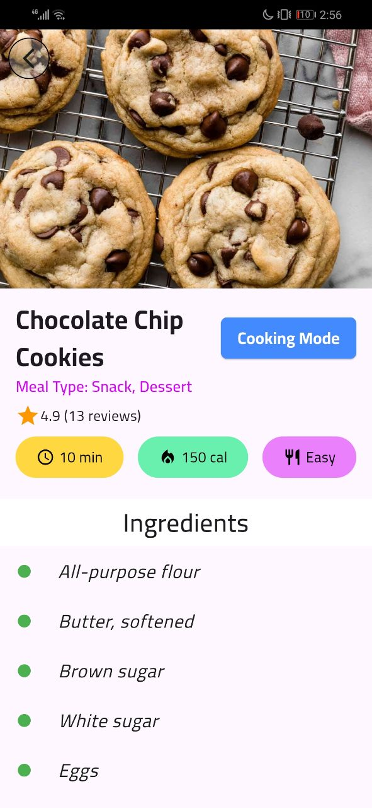
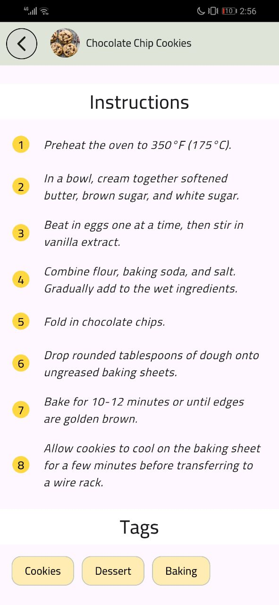

### Cooking Mode Screen
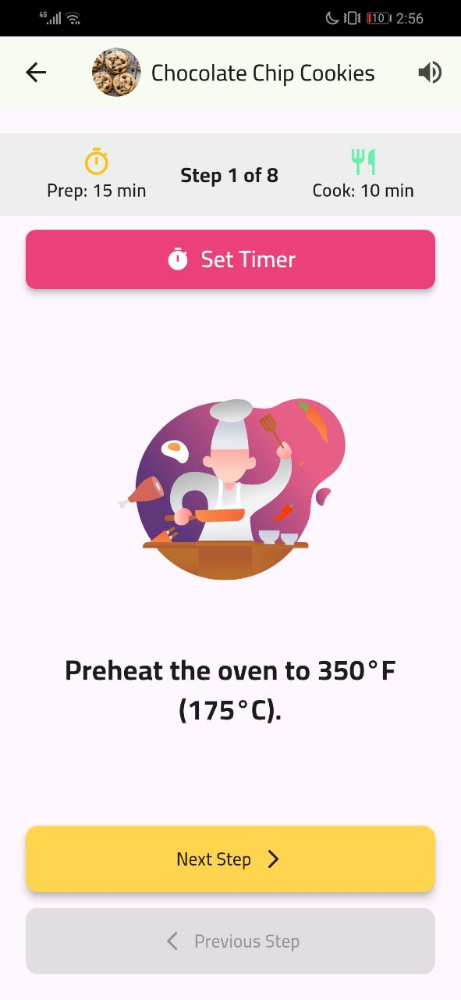
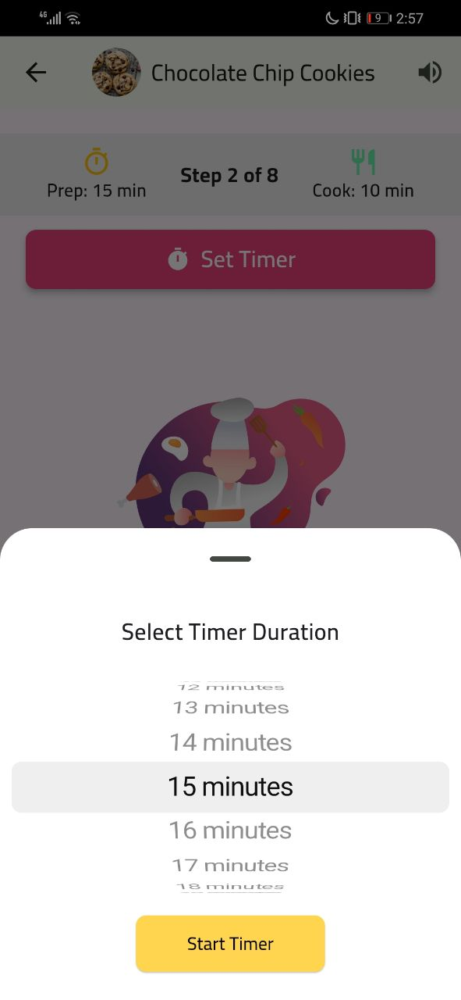

## Dark Mode

### Home Screen
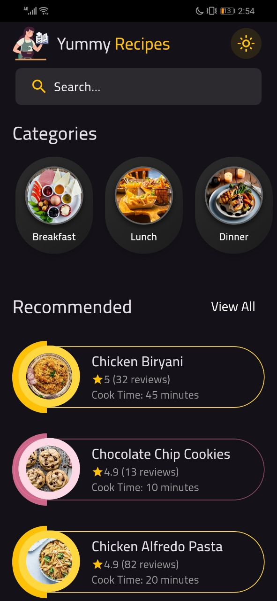

### Breakfast Recipes (Category Example)
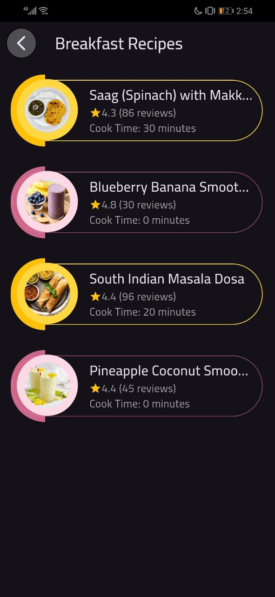

### Recommended Screen
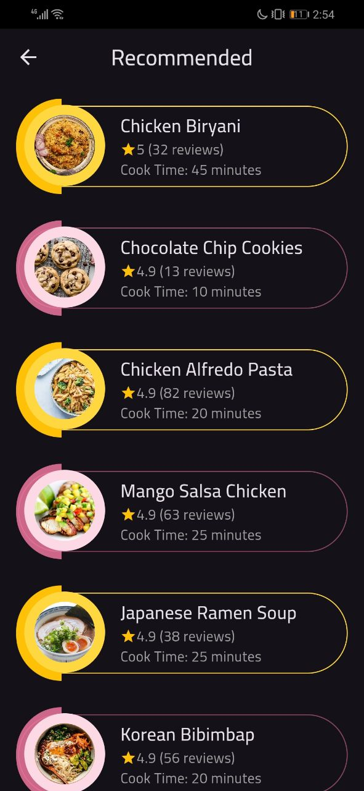

### Search Screen

### Search Results Screen
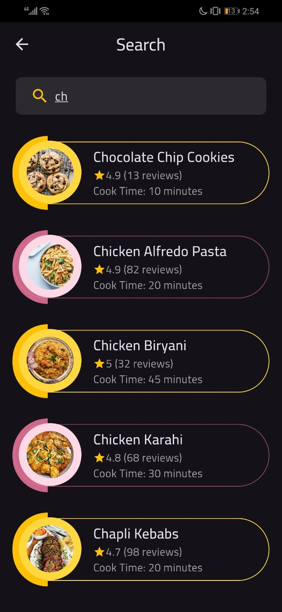

### Recipe Details Screen
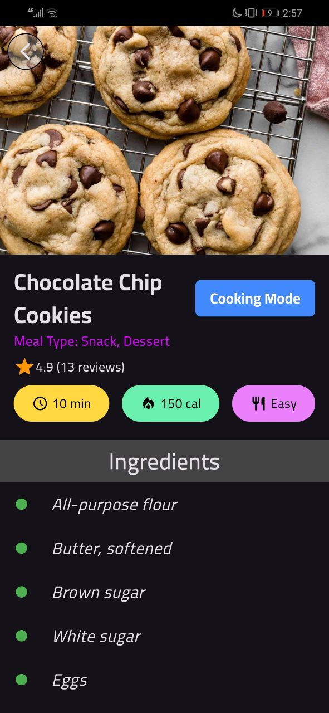
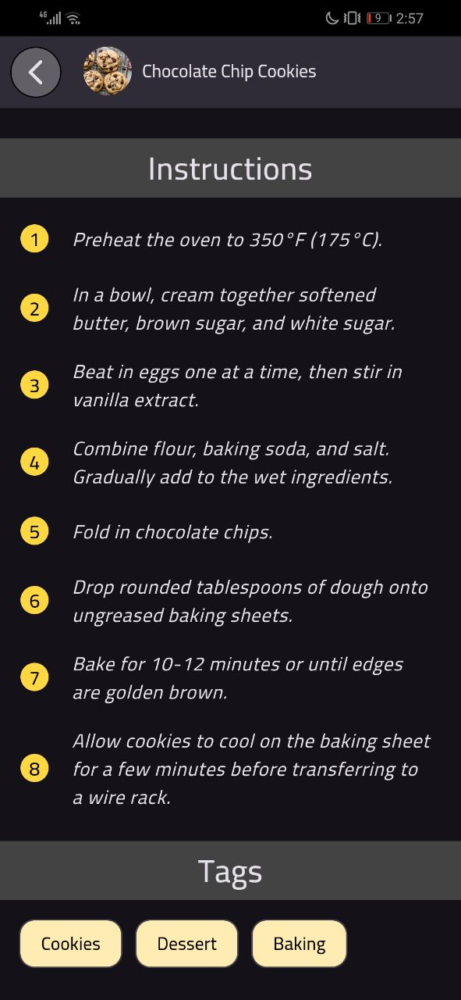

### Cooking Mode Screen
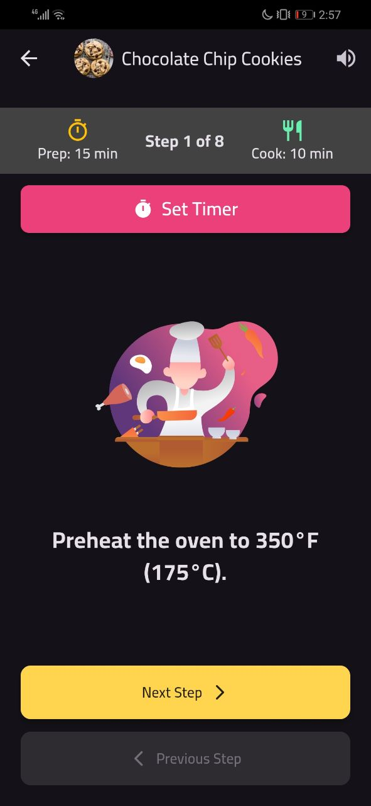
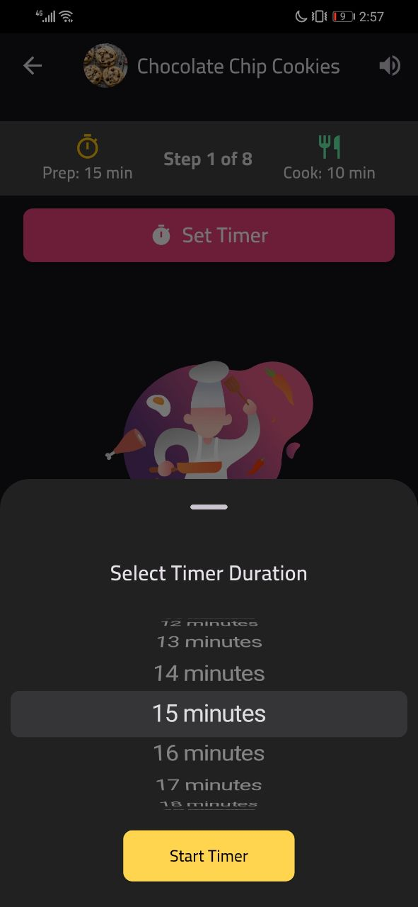

